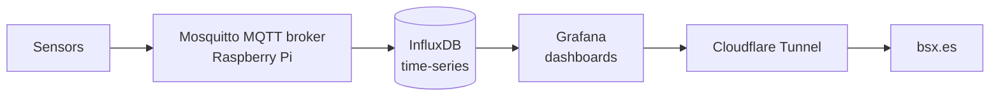

<!-- ============================================================
  REPLACE BEFORE PUBLISHING:
  - YOUR_GITHUB_USER  -> your GitHub username
  - YOUR_LINKEDIN_SLUG -> your LinkedIn profile slug
  Delete any line you can't back up in an interview.
============================================================ -->

# Hi, I'm Andrés Espinel 👋

### Telecommunications Engineer · IIoT & Telemetry · Cloud Infrastructure

*I build the full path from the sensor to the dashboard, and keep the infrastructure underneath it reliable.*

 

 

📍 Valladolid, Spain &nbsp;·&nbsp; 🌍 Open to remote (EU / international) &nbsp;·&nbsp; 🗣️ English B2 · Spanish (native)

---

## 👨‍💻 About Me

I'm a Telecommunications Engineer (Telematics) from the **University of Valladolid**. At **NTT DATA** I work on critical infrastructure for **Telefónica** and **Cepsa/Moeve**: Linux, VMware vSphere, VLAN-isolated networks, patching, and backup & disaster recovery with NetBackup.

Outside work, I design telemetry and automation systems end to end: MQTT brokers, time-series databases, real-time dashboards, containers and Kubernetes labs. What I enjoy most is turning raw data from the physical world into something observable, secure and dependable.

**What I'm looking for:** industrial digitalization, sensor and telemetry projects, and data-acquisition architectures.

---

## 🧰 Tech Stack

### ☁️ Systems & Cloud
`Linux` · `VMware vSphere` · `PowerCLI` · `Docker` · `Kubernetes` · `VPS administration` · `NetBackup` · `Disaster Recovery (DRP/BRP)`

### 📡 IIoT & Telemetry
`MQTT` · `Mosquitto` · `InfluxDB` · `Grafana` · `Raspberry Pi` · `Arduino` · `Sensor integration` · `Real-time dashboards`

### 🔐 Networks & Security
`IP networking` · `VLANs & network isolation` · `Firewalls` · `SSH` · `Cloudflare Tunnel` · `OS patching (ENS)`

### ⚙️ Dev & Automation
`Python (FastAPI, Flask)` · `C/C++` · `Bash scripting` · `REST APIs` · `SQL` · `n8n` · `Git & GitHub` · `Jira / Confluence`

---

## 🚀 Featured Projects

### 📡 [weather-station-iot](https://github.com/YOUR_GITHUB_USER/weather-station-iot)
**Real-time weather station: end-to-end telemetry architecture (Bachelor's Thesis)**

A complete data-acquisition pipeline, from sensor to public dashboard.

- **Stack:** MQTT (Mosquitto) · InfluxDB · Grafana · Raspberry Pi · Cloudflare Tunnel
- **Highlights:** network design, time-series storage, real-time visualization, and secure internet exposure through a Cloudflare Tunnel under a custom domain, with no ports opened on the router.
- 🌐 Live: [bsx.es](https://bsx.es)

---

### ☸️ [k8s-docker-lab](https://github.com/YOUR_GITHUB_USER/k8s-docker-lab)
**Multi-worker Kubernetes cluster and containerization lab**

Home lab to practice production-style operations on virtual machines.

- **Stack:** Kubernetes (control plane + multiple workers) · Docker · Nginx · Bash
- **Highlights:** automated container deployments, horizontal scaling, high-availability validation and **self-healing tests** (killing pods and nodes to watch recovery).
- **Focus:** reproducible setup, documented step by step.

---

### 🔄 [automation-workflows-n8n](https://github.com/YOUR_GITHUB_USER/automation-workflows-n8n)
**Workflow automation and service integration**

- **Stack:** n8n · REST APIs · Webhooks · JSON · Docker
- **Highlights:** automated flows that connect external services and publish content autonomously, replacing repetitive manual work.

---

### 🧠 Dream Decoder: AI app on a self-managed VPS
**Python backend + Gemini API, deployed with Docker**

- **Stack:** Python · Gemini API (prompt engineering) · Docker · Linux VPS · Cloudflare
- **Highlights:** I configured and deployed the whole stack myself, from the Linux server to the containers and the public domain.
- 🌐 Live: [dreamdecoderapp.com](https://dreamdecoderapp.com)

---

## 💼 Professional Experience

| Role | Where | What I do |
|---|---|---|
| **Junior IT Operations & Infrastructure Engineer** (2025 – present) | NTT DATA · Telefónica (GALILEO) | Linux and VMware vSphere operations, backup & restore ownership with NetBackup, OS patching under ENS, technical coordination of 3 junior engineers |
| **Disaster Recovery Engineering Intern** (2025) | NTT DATA · Cepsa/Moeve (BRP) | DR tests for critical services, restores in VLANs isolated from the internet, RTO estimates and feasibility reports |

---

## 🎓 Education

- **B.Sc. in Telecommunication Technologies Engineering (Telematics)**, University of Valladolid (2020 – 2025)
- **Erasmus+**, Aristotle University of Thessaloniki, Greece (2024 – 2025)

---

## 📊 GitHub Stats

---

## 📫 Let's Connect

*Open to conversations about IIoT, telemetry, data acquisition and infrastructure.*

